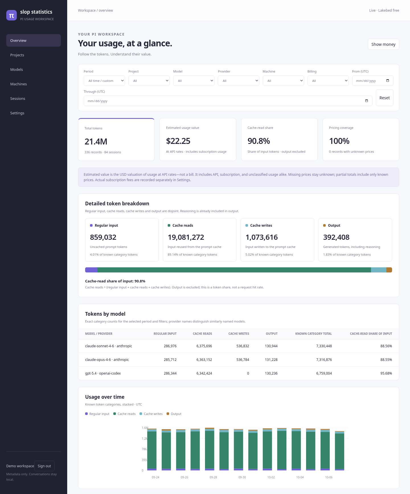

# Slop Statistics

A private usage dashboard for [Pi Coding Agent](https://pi.dev), with a Pi extension that collects metadata across your machines. Compare repositories, models, and sessions by tokens, cache activity, and **estimated usage value at API rates**—including subscription usage, not an extra bill.


*Screenshot uses synthetic demo data.*

Git/jj worktrees share a project. No prompts, source code, tool output, or credentials are uploaded. Offline uploads stay queued locally; no daemon is needed.

## Deploy your dashboard

Requires **Node 24+**, Pi, and a [Lakebed](https://lakebed.dev) account.

```sh
git clone https://github.com/ArthurHeymans/slop-statistics.git
cd slop-statistics
npm ci
npm run setup
npx lakebed auth login
npm run build && npm run deploy
```

Open the URL printed by Lakebed, sign in with **Google**, and claim ownership using `.local/owner-setup-key`. Only that account can read the dashboard. Each clone creates its own deployment; keep the generated `capsule/lakebed.json` locally, never publish it or the secrets.

## Connect Pi

From this checkout, paste `.local/upload-token` when prompted. For another machine, create a credential in dashboard **Settings** and initialize that machine separately.

```bash
read -rsp 'Upload token: ' SLOP_TOKEN; echo; export SLOP_TOKEN
npm run collector -- init --url https://YOUR-APP.lakebed.app
unset SLOP_TOKEN
pi install "$PWD"
```

Restart Pi or `/reload`. The extension syncs every three minutes while Pi runs. Commands: `/slop-status`, `/slop-sync`, and `/slop-import` (optional history).

After configuring the collector, you can alternatively install the extension with `pi install git:github.com/ArthurHeymans/slop-statistics`. Use one installation method, not both.

**Free hosting limits:** 1 MiB database, 1,000 mutations/day, 10,000 requests/day. History can fill this quickly; nothing is silently pruned. Missing prices remain unknown. Export regularly.

[Accounting, configuration, privacy, testing, and recovery](docs/reference.md).

## License

[MIT](LICENSE-MIT) **or** [Apache-2.0](LICENSE-APACHE), at your option. Applies to the dashboard, collector, and Pi extension.
